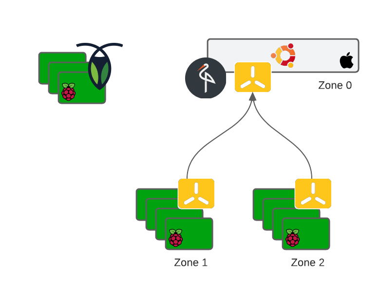

# rpi-cloud-init

This repository supports the initialization of my at-home cloud.

My goal is to build a modular, relatively low-power system.

## Hardware

- 1x 2013 Apple Mini
  - **Operating System / Architecture:** Ubuntu 20.04 / amd64
  - **Specs:** 8 CPU, 16GB RAM, 512GB Disk (eventually 1TB)
  - **Media:**
    - 512GB flash drive (USB 3.0)
  - **Services**: MinIO, k3s (server)
- 3x Raspberry Pi 4
  - **Operating System / Architecture:** Ubuntu 20.04 / arm64
  - **Specs:** 4 CPU, 4GB RAM, 32GB Disk
  - **Media:**
    - 512GB flash drive (USB 3.0)
  - **Services**: CockroachDB
- 8x Raspberry Pi 3b+
  - **Operating System / Architecture:** Ubuntu 20.04 / arm64
  - **Specs:** 4 CPU, 1GB RAM, 32GB Disk
  - **Services**: k3s (agent)

## Cluster

 - Provisioning
   - [cloud-init](cloud-init) - Machine initialization
   - [terraform](https://www.terraform.io/) - Declarative provisioning
   - [cert-manager](compute/workloads/cert-manager) - Certificate management
 - Storage
   - [CockroachDB](storage/crdb) - Relational database management system
   - [MinIO](storage/minio) - Erasure coded, small-blob storage
 - Compute
   - [docker](https://www.docker.com/) / [docker-machine](scripts/docker-machine) - Containerization (deprecate)
   - [k3s](compute/k3s) - Extendable compute cluster
   - To do:
     - containerd - Containerization
 - Observability
   - [prometheus](compute/workloads/prometheus) - Data collection and storage
   - [grafana](compute/workloads/grafana) - Data visualization

## Workloads

 - [services](compute/workloads/services) - Aliases for out-of-cluster services
 - [redis](https://redis.io) - General purpose, caching solution
 - [homestead](https://github.com/mjpitz/homestead) - Index builders that help manage my homestead
 - [varys](https://github.com/mjpitz/varys) - Secret engine and privileged access management
